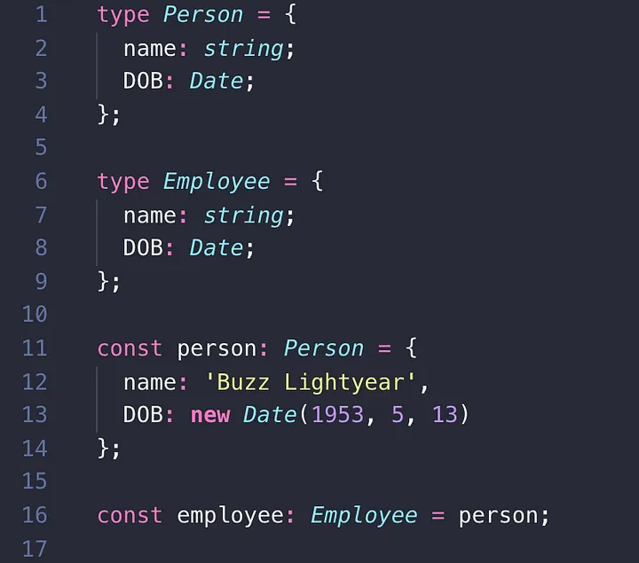

# What is TypeScript?

- Typescript is a strongly typed, object oriented, compiled proramming language built on Javascript.

- It supports **type cheaking** ensuring that the data flowing through the program is of the correct kind.

- Typescript calls itself **JavaScript with syntax of types** in short it's javascript with some additional features.

- Typescript offers **optional static typing** and type inferencing that can infer undeclared variables.

- It supports object oriented programming

- Competitor languages are **Dart** and **coffeescript**

## Components of typescript

1. **Language:** the syntax, keyword, and type annotations

2. **The TypeScript Compiler (TSC):** converts the instructions to JavaScript.

## Structural Typing

- **Structural typing**  is a way of relating types based solely on their members.



- variable declared as the **Person type** is assignable to a variable of the **Employee type** without any casting, coercion, or even knowing ahead of time that both of these types, as named, existed at all.
- They are just aliases of the same type and the structure is the type.

```typescript
//interfaces.ts
interface student{
    id: number
    name: string
}

const printStudentsId = (student: student) =>{
    console.log(student.id);
    console.log(student.name);
}

let student = { id:1323, name:'Brian'}
printStudentId(student)
```

## Type